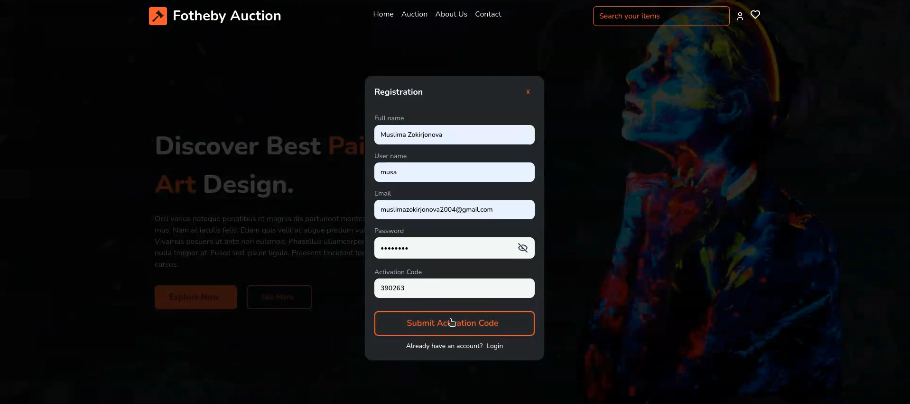
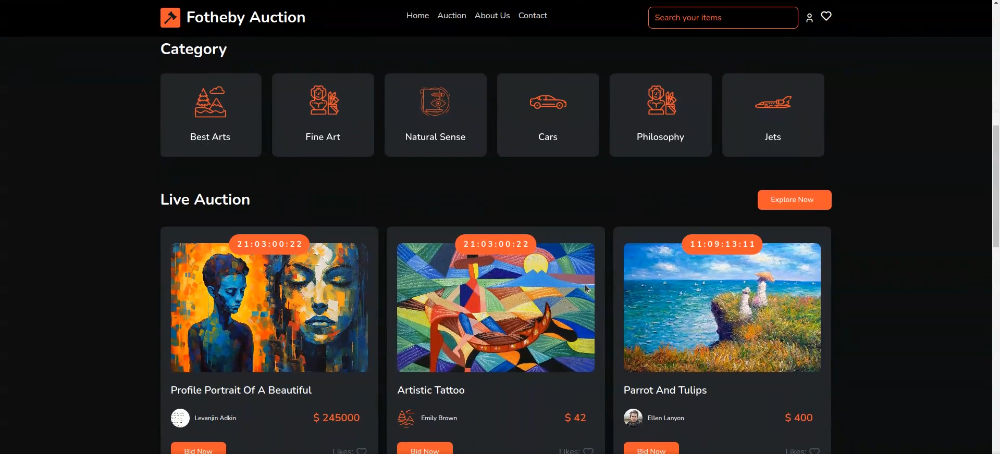

# Aristo Auctions Frontend

## Author
Zokirjonova Muslima

## Description
This project is the frontend for Aristo Auctions, a platform for managing and participating in auctions.

## Technologies Used
- TypeScript
- JavaScript
- Vue.js
- Yarn
- npm

## Project Setup

### Clone the Repository

```bash
git clone https://github.com/ikramovna/aristo_auctions_front.git
```

### Change Directory

```bash
cd aristo_auctions_front
```

### Install Dependencies
```bash
yarn install
# or
npm install
```

### Run the Project
```bash
yarn serve
# or
npm run serve
```

### Build the Project
```bash
yarn build
# or
npm run build
```

### Lint the Project
```bash
yarn lint
# or
npm run lint
```

### Project Overview
The project is a frontend for Aristo Auctions, a platform for managing and participating in auctions. The project is built using Vue.js and TypeScript. The project is structured as follows:

### Main Website Interface:
- Home Page
***


***

### Register Page
***



***

### Categories Page
***



***

### Auctions List Page
***


***

### Auction Detail Page
***


***


